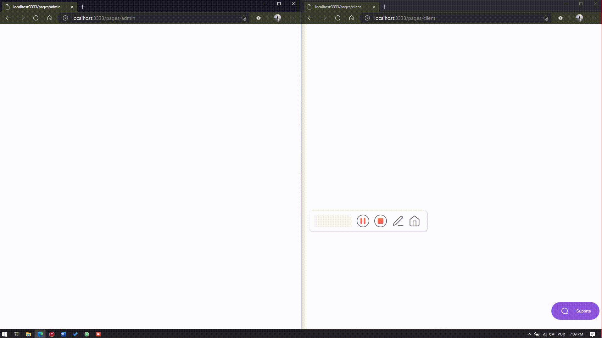

<h1 align="center"> Chatty 📨 </h1>

<h2 align="center">
    Send messages and solve your problems the easy way.
</h2>

<h3 align="center">
  Built using Node.js
</h3>

# Cloning this repository

```
git clone https://github.com/pedromarquex/chatty.git
```

# ❗️ Requisites

To run aplication we need have installed:

- [Node](https://nodejs.org/en/)
- [Yarn](https://yarnpkg.com/lang/en/) (Optional)

## 💻 Server

<h3 align="center">
  A light chat based application made using realtime communication.
</h3>

<p>
  In this project we use:
</p>

- [Express](https://expressjs.com/) as Node.js framework.
- [TypeScript](https://www.typescriptlang.org/), to add static types definitions.
- [TypeORM](https://typeorm.io/), as way to communicate with databases.
- [socket.io](https://socket.io/) for realtime communication.
- [SQLite](https://www.sqlite.org/), as SQL database.

### ⚡️ Start

To start application, run:

```
cd chatty
yarn
yarn typeorm migration:run
yarn dev

# or

cd chatty
npm install
npm run typeorm migration:run
npm run dev
```
## To run this app in a web browser

navigate to [localhost:3333/pages/admin](localhost:3333/pages/admin) and [localhost:3333/pages/client](localhost:3333/pages/client) and enjoy sending messages.

# App Demo

<h1 align="center">
    
</h1>

Tks to [@rennand](https://github.com/rennand) for the amazing template.
